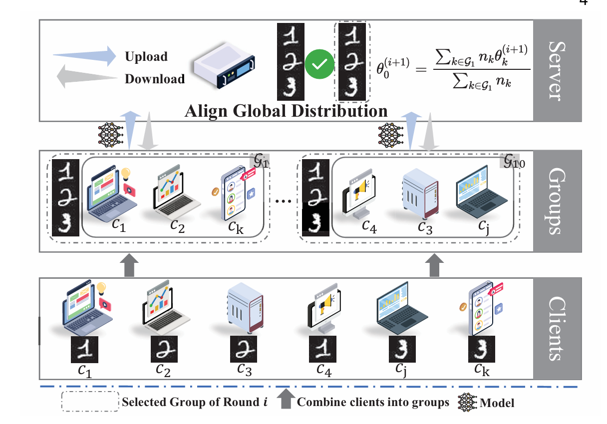

## Group-based Federated Learning with Cost-efficient Sampling Mechanism in Mobile Edge Computing Networks

The paper is currently under review (in IEEE Trans. Mobile Comput.).

The part of the work was published in the IEEE International Conference  on Communications (ICC), Denver, CO, USA, 9–13 June 2024 (<a href="https://ieeexplore.ieee.org/document/10623087" target="_blank">Energy-Efficient Client Sampling for Federated Learning in Heterogeneous Mobile Edge Computing Networks</a>).

**Title:** Group-based Federated Learning with Cost-efficient Sampling Mechanism in Mobile Edge Computing Networks

**Author:**  Jian Tang, Xiuhua Li, Guozeng Xu, Penghua Li, Xiaofei Wang, Victor C. M. Leung


### 1. Background and problem

Client sampling mechanism is essential for federated learning (FL) in mobile edge computing (MEC) networks, given the system and data heterogeneity of mobile clients (MCs). 
However, most of the current research on client sampling mechanisms is for individuals.
There is literature that experimentally proves that group-based sampling is superior to individual-based sampling to some extent.
Therefore, we study group-based sampling; however, group-based sampling requires labels from MCs to form.
Moreover, group-based sampling rarely considers the costs (i.e., latency and energy consumption) incurred by the MCs.
To address these challenges, we investigate and formulate the issue of group-based FL with a sampling mechanism for reducing costs in MEC networks. 
We have formulated the problem. (The process is in the paper.)



Figure 1. Group-based Federated Learning Model in a MEC Network. 

### 2. Proposed GFLCSM Framework

GFLCSM contains three components to solve the proposed problem.
Specifically, GFLCSM has three core modules:

1) inferring the data distribution of MCs,
2) forming group-based FL,
3) designing a cost-efficient sampling mechanism.

### 3. Experiments

You can run through the experiment with the following code

```
python main.py --server proposed
```
